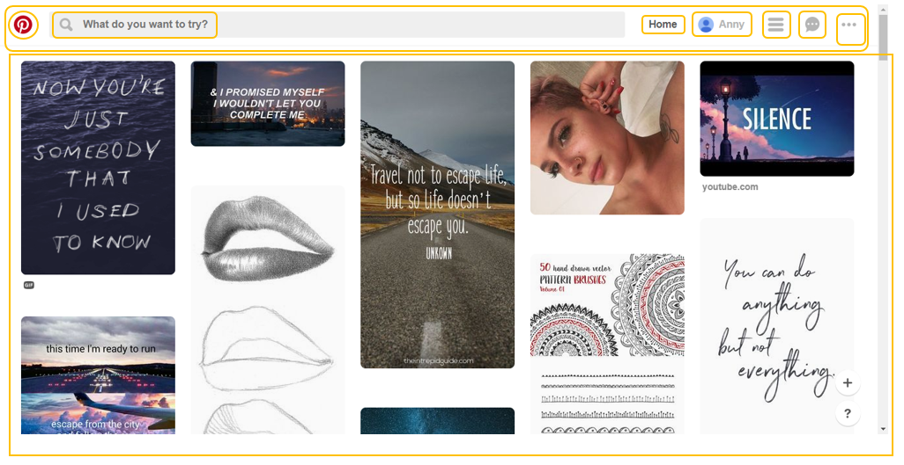

#  Reto uno: UX != UI
 Elige una web de tu preferencia y explica qué partes conforman el UX y qué partes el UI:

 * **Pinterest**
 * **Youtube**
 * **Laboratoria**
 
 En este caso vamos a centrarnoes en la red social [Pinterest](https://www.pinterest.com/).
 
 

 ## Ubicando las partes que conforman el UX & UI
 
UX | UI
---|---
red | green 

